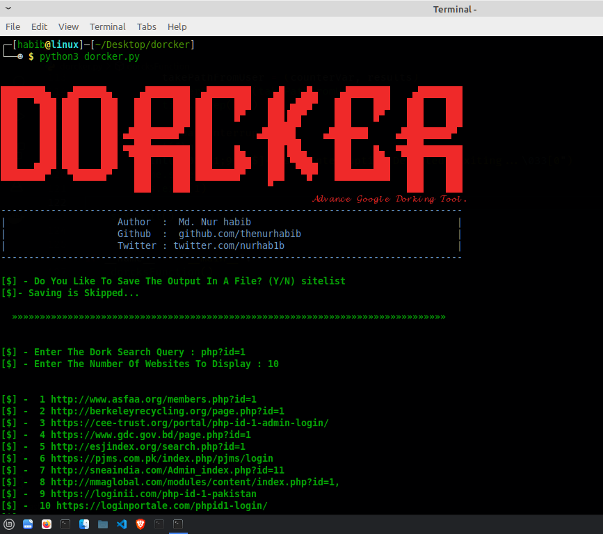

# Dorcker - Advance Google Dorking Tool.

#### Dorcker is a Advanced Google Dorking Tool. You can use this tool to find vulnerable website via google dork.
  


## Badges


[](https://opensource.org/licenses/)


## Usage :
### Download & Install : 
```git clone https://github.com/thenurhabib/dorcker```

```cd dorcker```

```pip install -r requirements.txt```

```python3 dorcker.py```

## Demo

<br>




## Authors

- [@Md. Nur Habib](https://www.github.com/octokatherine)


## Support

For support, email thenurhabib@gmail.com

